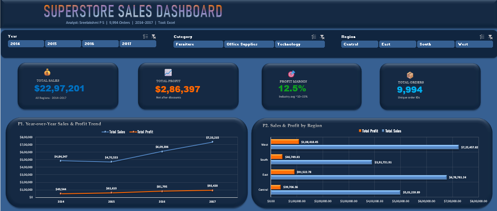
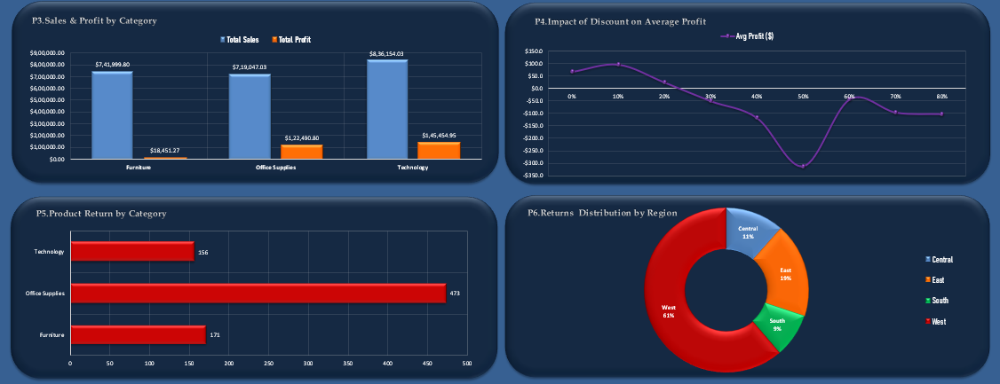
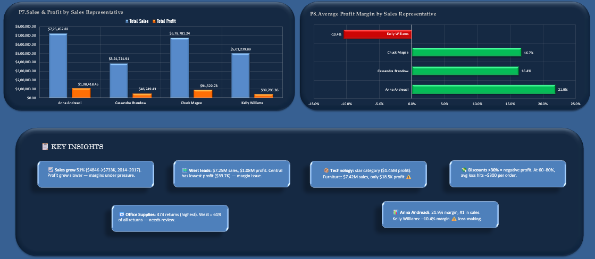

# super-store-sales
Interactive Excel dashboard analyzing 9,994 Superstore  orders (2014–2017) | Pivot Charts | Slicers | KPI Cards

# 🛒 Superstore Sales Analysis Dashboard

## 📌 Project Overview
An interactive Excel dashboard analyzing 9,994 orders 
from a US Superstore (2014–2017) across 4 regions, 
3 categories, and 4 sales representatives.

## 🛠️ Tool Used
Microsoft Excel — Pivot Tables, Pivot Charts,
Slicers, Conditional Formatting, Dynamic KPIs

## 📊 Dashboard Features
- 4 dynamic KPI cards (Sales, Profit, Margin, Orders)
- 8 interactive pivot charts
- 3 slicers (Year, Category, Region)
- Key Insights section with business findings

## 🔍 Key Findings
- Sales grew 51% from $484K (2014) to $733K (2017)
- West region leads: $7.25M sales & $1.08M profit
- Technology: most profitable category (17.4% margin)
- Discounts above 30% consistently produce losses
- West accounts for 61% of all product returns
- Anna Andreadi: best margin at 21.9%
- Kelly Williams: only loss-making rep at –10.4%

## 📸 Dashboard Preview

## 👩‍💻 Analyst
Sreelakshmi P S

